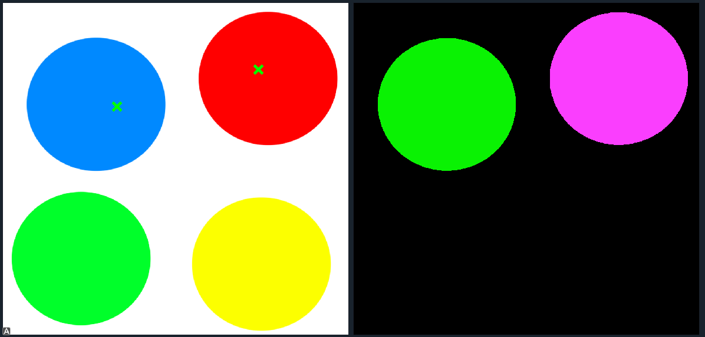
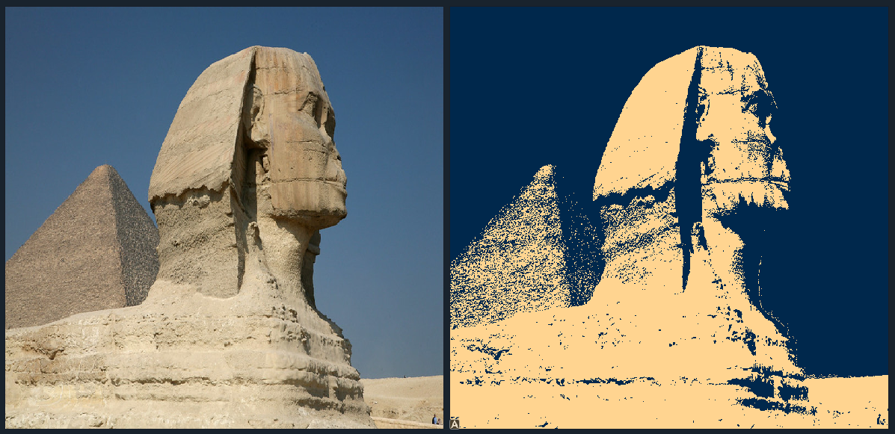
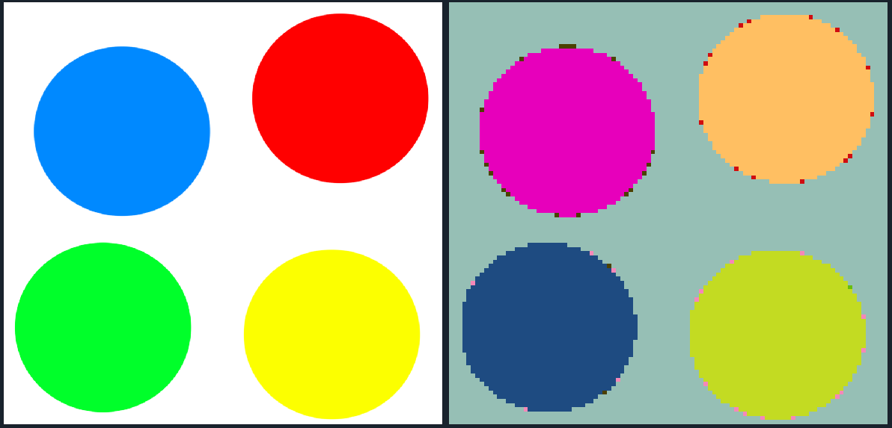

# Segmentor
## Description
Segmentor is a desktop application built with PyQt to perform various thresholding and segmentation techniques on grayscale and color images. The application implements optimal thresholding, Otsu's method, spectral thresholding, and local thresholding for grayscale images. For grayscale and color images, it supports unsupervised segmentation using k-means, region growing, agglomerative clustering, and mean shift methods.

## Table of Contents
1. [Installation](#installation)
2. [Usage](#usage)
3. [Features](#features)
4. [Contributors](#Contributors)

## Installation
To install the project, clone the repository and install the dependencies:

```bash
# Clone the repository
git clone https://github.com/Zoz-HF/Segmentor.git

# Navigate to the project directory
cd Segmentor
```

## Usage
To run the application, use the following command:

```bash
python index.py
```

## Features
### Thresholding for Grayscale Images
- Optimal Thresholding
- Otsu's Method
- Spectral Thresholding (more than 2 modes)
- Local Thresholding

### Unsupervised Segmentation for Grayscale and Color Images
- K-means Clustering
  
- Region Growing
  
- Agglomerative Clustering
  
- Mean Shift Method
  

## Contributors <a name = "contributors"></a>
<table>
  <tr>
    <td align="center">
    <a href="https://github.com/AbdulrahmanGhitani" target="_black">
    
    <br />
    <sub><b>Abdulrahman Shawky</b></sub></a>
    </td>
  <td align="center">
    <a href="https://github.com/Zoz-HF" target="_black">
    
    <br />
    <sub><b>Ziyad El Fayoumy</b></sub></a>
    </td>
<td align="center">
    <a href="https://github.com/omarnasser0" target="_black">
    
    <br />
    <sub><b>Omar Abdulnasser</b></sub></a>
    </td>
    <td align="center">
    <a href="https://github.com/MohamedSayedDiab" target="_black">
    
    <br />
    <sub><b>Mohammed Sayed Diab</b></sub></a>
    </td>
     <td align="center">
    <a href="https://github.com/RushingBlast" target="_black">
    
    <br />
    <sub><b>Assem Hussein</b></sub></a>
    </td>
      </tr>
 </table>
